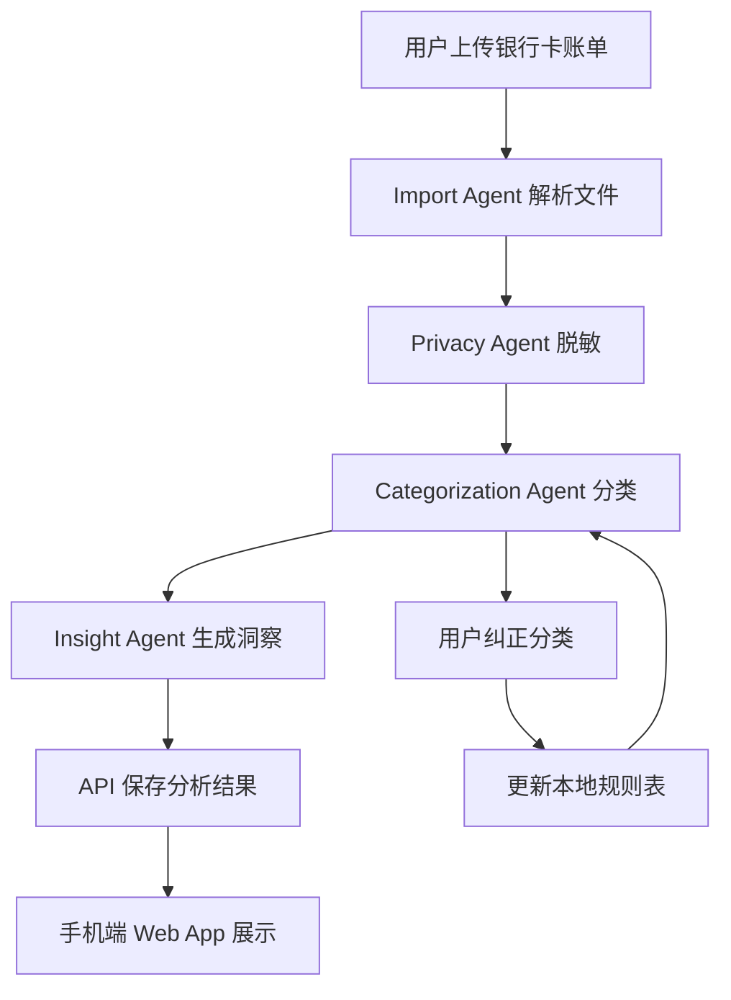
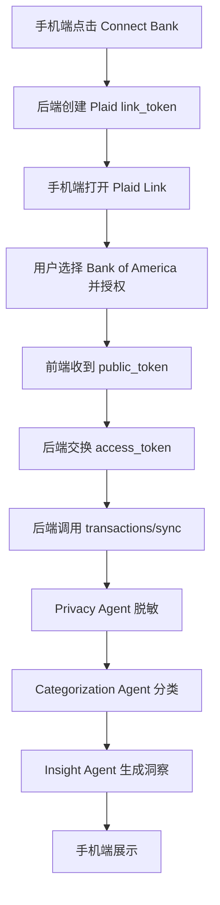

# 银行卡花销分析 Agent Workflow

## 目标

读取银行卡花销记录，自动清洗、分类、汇总和解释消费情况，并在手机端显示一个适合日常查看的账单看板。

## V1 范围

- 支持上传银行导出的 CSV 或 Excel 账单。
- 自动识别交易日期、金额、商户、摘要、收支方向。
- 按餐饮、交通、购物、订阅、转账、住房、医疗、娱乐等类别归类。
- 生成月度总览、分类占比、异常消费提醒、订阅支出列表。
- 手机端以 Web App 形式展示。
- 默认不保存原始银行卡号、完整商户流水号、身份证号等敏感字段。

## 不做的事

- 不要求用户输入网银账号密码。
- 不直接抓取银行 App 或短信验证码。
- 不在没有用户确认的情况下自动发起转账、还款或任何金融操作。
- 不把原始账单直接发给第三方模型；需要模型分析时先做脱敏。

## Agent 角色

### 1. Import Agent

职责：

- 接收 CSV、Excel 或 PDF 账单。
- 解析不同银行的字段格式。
- 输出统一交易结构。

输入：

```json
{
  "file": "bank_statement.xlsx",
  "bank_hint": "optional"
}
```

输出：

```json
{
  "transactions": [
    {
      "date": "2026-05-18",
      "description": "STARBUCKS",
      "merchant": "STARBUCKS",
      "amount": -38.0,
      "currency": "CNY",
      "direction": "expense",
      "raw_category": "",
      "source": "uploaded_statement"
    }
  ]
}
```

### 2. Privacy Agent

职责：

- 删除或遮蔽银行卡号、账号、流水号、手机号、身份证号。
- 给交易记录生成内部 ID。
- 保留分析所需字段，丢弃无关敏感字段。

输出示例：

```json
{
  "transaction_id": "txn_01J...",
  "date": "2026-05-18",
  "merchant": "STARBUCKS",
  "description_masked": "STARBUCKS",
  "amount": -38.0,
  "currency": "CNY"
}
```

### 3. Categorization Agent

职责：

- 用规则优先、模型辅助的方式分类。
- 常见商户用本地规则表直接命中。
- 未命中的交易再交给 LLM 判断。
- 支持用户手动纠正，并把纠正写回规则。

分类标签：

```json
[
  "餐饮",
  "交通",
  "购物",
  "住房",
  "水电燃气",
  "医疗",
  "教育",
  "娱乐",
  "订阅",
  "旅行",
  "转账",
  "收入",
  "其他"
]
```

### 4. Insight Agent

职责：

- 生成可解释的消费洞察。
- 找出本月最大支出、环比变化、异常交易、重复订阅。
- 给出预算提醒，但不做投资或贷款建议。

输出示例：

```json
{
  "month": "2026-05",
  "total_income": 18000,
  "total_expense": 9340.5,
  "top_categories": [
    { "category": "餐饮", "amount": 2180.2 },
    { "category": "购物", "amount": 1640.0 }
  ],
  "alerts": [
    {
      "type": "unusual_spend",
      "title": "单笔购物支出偏高",
      "detail": "5 月 22 日有一笔 1280 元购物消费，高于你近 90 天购物单笔均值。"
    }
  ]
}
```

### 5. Mobile Presentation Agent

职责：

- 把分析结果转换为手机端页面数据。
- 提供首页卡片、分类图表、交易列表和提醒页。
- 支持按月份、分类和银行卡筛选。

手机端首屏建议：

- 本月支出
- 本月收入
- 可用余额或结余
- 最大消费类别
- 最近异常提醒
- 最近 10 笔交易

## Workflow



## 推荐技术栈

### 快速原型

- 前端：Next.js 或 Vite React
- 手机端：响应式 Web App，后续可封装成 PWA
- 后端：Node.js API 或 Python FastAPI
- 文件解析：SheetJS、Papa Parse、pdfplumber
- 数据库：SQLite 或 Supabase
- 图表：Recharts
- Agent 编排：LangGraph、OpenAI Responses API tool calls，或轻量自定义 pipeline

### 隐私优先版本

- 文件解析和分类规则尽量在本地执行。
- LLM 只接收脱敏后的商户名、金额、日期和上下文。
- 允许用户关闭云端分析。
- 原始账单加密存储，或处理后立即删除。

## 数据模型

### transaction

```sql
CREATE TABLE transactions (
  id TEXT PRIMARY KEY,
  date TEXT NOT NULL,
  merchant TEXT,
  description_masked TEXT,
  amount REAL NOT NULL,
  currency TEXT DEFAULT 'CNY',
  direction TEXT NOT NULL,
  category TEXT,
  account_alias TEXT,
  created_at TEXT NOT NULL
);
```

### category_rule

```sql
CREATE TABLE category_rules (
  id TEXT PRIMARY KEY,
  pattern TEXT NOT NULL,
  category TEXT NOT NULL,
  confidence REAL DEFAULT 1.0,
  created_by TEXT DEFAULT 'user'
);
```

### monthly_insight

```sql
CREATE TABLE monthly_insights (
  id TEXT PRIMARY KEY,
  month TEXT NOT NULL,
  summary_json TEXT NOT NULL,
  created_at TEXT NOT NULL
);
```

## API 草案

```http
POST /api/import
Content-Type: multipart/form-data

file=<statement.csv>
```

```http
GET /api/monthly-summary?month=2026-05
```

```http
GET /api/transactions?month=2026-05&category=餐饮
```

```http
POST /api/transactions/:id/category
Content-Type: application/json

{
  "category": "餐饮",
  "remember_rule": true
}
```

## LLM 分类 Prompt 模板

```text
你是一个个人记账分类助手。请根据交易商户、摘要、金额和方向，选择一个最合适的分类。

只能从这些分类里选择：
餐饮、交通、购物、住房、水电燃气、医疗、教育、娱乐、订阅、旅行、转账、收入、其他

不要输出解释，只输出 JSON。

交易：
日期：{{date}}
商户：{{merchant}}
摘要：{{description_masked}}
金额：{{amount}}
方向：{{direction}}

输出格式：
{
  "category": "...",
  "confidence": 0.0,
  "reason": "一句话说明"
}
```

## 手机端页面结构

```text
/                 本月总览
/transactions     交易列表
/categories       分类分析
/alerts           异常提醒
/settings/rules   分类规则
```

## 下一步实现顺序

1. 做一个手机端 Web 原型，支持上传 CSV。
2. 实现账单字段自动映射。
3. 加本地规则分类。
4. 加分析 summary。
5. 接入 LLM 做低置信度交易分类。
6. 做用户纠正分类和规则学习。
7. 加密存储或处理后删除原始文件。

## Bank of America API 接入路线

Bank of America 目前有多个开发者入口，但用途不同：

- CashPro Developer Studio：偏企业客户、财资管理、付款、账户信息和交易历史。
- Data Services API Portal：面向 Bank of America Consumer and Small Business APIs，需要注册、sandbox 和 BofA 审核上线。
- Merchant Services Developer Portal：偏商户收款、支付处理，不适合读取个人银行卡花销。
- Plaid / MX / Finicity：更适合个人财务 App 读取用户授权后的账户、余额和交易记录。

### 推荐 V1：Plaid 连接 Bank of America

原因：

- 不需要用户把 Bank of America 密码交给我们的服务器。
- 手机端可以通过 Plaid Link 完成授权。
- 后端拿到 `access_token` 后读取账户和交易。
- 更适合个人花销分析 App 的场景。

流程：



后端需要的环境变量：

```bash
PLAID_CLIENT_ID=
PLAID_SECRET=
PLAID_ENV=sandbox
```

核心 API：

```http
POST /api/plaid/create-link-token
POST /api/plaid/exchange-public-token
POST /api/plaid/sync-transactions
```

数据存储建议：

- 保存 Plaid `access_token` 时必须加密。
- 不在日志里打印 token、账号号、完整交易原始描述。
- 只把脱敏后的交易交给 LLM。
- 提供 Disconnect Bank 功能，删除 token 和本地缓存交易。

### 备选：直接申请 BofA Data Services API

适合情况：

- 你要做正式 fintech 产品。
- 你有公司主体、合规说明、隐私政策和安全文档。
- 你愿意走 Bank of America 的审核与上线流程。

流程：

1. 注册 Bank of America Data Services API Portal。
2. 申请 Consumer and Small Business API sandbox。
3. 获取 sandbox client credentials。
4. 按 BofA 要求实现 OAuth / consent / token handling。
5. 通过安全、合规和生产上线审核。

### 不推荐：自动登录 Bank of America 网页或 App 抓数据

原因：

- 容易违反银行服务条款。
- 需要处理密码、MFA、验证码等高风险信息。
- 稳定性差，页面改版就会坏。
- 对用户隐私和账户安全风险太高。

## Plaid 接入步骤

本文件夹已经包含一个最小 Plaid Sandbox demo：

- 后端：[server/index.js](/Users/lvjingxuan/Desktop/¥¥¥¥/server/index.js)
- 手机端：[src/main.jsx](/Users/lvjingxuan/Desktop/¥¥¥¥/src/main.jsx)
- 运行说明：[README.md](/Users/lvjingxuan/Desktop/¥¥¥¥/README.md)

### 1. 创建 Plaid 账号

1. 去 Plaid Dashboard 注册开发者账号。
2. 在 Dashboard 里拿到：
   - `client_id`
   - `Sandbox secret`
3. 先使用 Sandbox 环境开发。

### 2. 安装后端 SDK

Node.js 示例：

```bash
npm install plaid express dotenv
```

### 3. 配置环境变量

```bash
PLAID_CLIENT_ID=你的_client_id
PLAID_SECRET=你的_sandbox_secret
PLAID_ENV=sandbox
PLAID_PRODUCTS=transactions
PLAID_COUNTRY_CODES=US
```

### 4. 初始化 Plaid Client

```js
import { Configuration, PlaidApi, PlaidEnvironments } from "plaid";

const configuration = new Configuration({
  basePath: PlaidEnvironments[process.env.PLAID_ENV || "sandbox"],
  baseOptions: {
    headers: {
      "PLAID-CLIENT-ID": process.env.PLAID_CLIENT_ID,
      "PLAID-SECRET": process.env.PLAID_SECRET,
    },
  },
});

export const plaidClient = new PlaidApi(configuration);
```

### 5. 后端创建 link_token

前端不能直接拿 Plaid secret，所以必须由后端创建 `link_token`。

```js
app.post("/api/plaid/create-link-token", async (req, res) => {
  const response = await plaidClient.linkTokenCreate({
    user: {
      client_user_id: "user_123",
    },
    client_name: "Spending Agent",
    products: ["transactions"],
    country_codes: ["US"],
    language: "en",
    transactions: {
      days_requested: 180,
    },
    webhook: "https://你的域名.com/api/plaid/webhook",
  });

  res.json({ link_token: response.data.link_token });
});
```

### 6. 手机端打开 Plaid Link

React 示例：

```bash
npm install react-plaid-link
```

```jsx
import { usePlaidLink } from "react-plaid-link";

function ConnectBankButton({ linkToken }) {
  const { open, ready } = usePlaidLink({
    token: linkToken,
    onSuccess: async (public_token, metadata) => {
      await fetch("/api/plaid/exchange-public-token", {
        method: "POST",
        headers: { "Content-Type": "application/json" },
        body: JSON.stringify({ public_token }),
      });
    },
  });

  return (
    <button onClick={() => open()} disabled={!ready}>
      Connect Bank
    </button>
  );
}
```

### 7. 后端交换 public_token

`public_token` 是临时 token，必须换成 `access_token`。`access_token` 要加密保存。

```js
app.post("/api/plaid/exchange-public-token", async (req, res) => {
  const { public_token } = req.body;

  const response = await plaidClient.itemPublicTokenExchange({
    public_token,
  });

  const accessToken = response.data.access_token;
  const itemId = response.data.item_id;

  // TODO: 加密保存 accessToken，并关联当前用户
  res.json({ item_id: itemId });
});
```

### 8. 同步交易

Plaid 官方推荐用 `/transactions/sync` 做增量同步。第一次传 `cursor: null`，之后保存 `next_cursor`。

```js
app.post("/api/plaid/sync-transactions", async (req, res) => {
  const accessToken = await loadEncryptedAccessTokenForUser("user_123");
  let cursor = await loadCursorForItem("item_123");

  let added = [];
  let modified = [];
  let removed = [];
  let hasMore = true;
  let nextCursor = cursor || null;

  while (hasMore) {
    const response = await plaidClient.transactionsSync({
      access_token: accessToken,
      cursor: nextCursor,
    });

    added = added.concat(response.data.added);
    modified = modified.concat(response.data.modified);
    removed = removed.concat(response.data.removed);
    nextCursor = response.data.next_cursor;
    hasMore = response.data.has_more;
  }

  await saveCursorForItem("item_123", nextCursor);

  // TODO: 把 added/modified/removed 写入本地 transactions 表
  // TODO: 触发 Privacy Agent、Categorization Agent、Insight Agent
  res.json({
    added: added.length,
    modified: modified.length,
    removed: removed.length,
  });
});
```

### 8.1 可选：小模型分类

本 demo 已经接入可选的小模型分类。默认模型：

```bash
OPENAI_MODEL=gpt-4.1-nano
```

策略：

- 先用本地规则和 Plaid `personal_finance_category`。
- 只有 `Other`、`Payment`、`Transfer` 等低置信度分类才发给 LLM。
- 发给 LLM 的字段只包含日期、商户名、金额和 Plaid 粗分类。
- 不发送 Plaid token、账号、银行卡号或完整原始账户信息。
- LLM 必须从固定分类集合里输出，避免生成奇怪的新类别。

### 9. Webhook

Plaid 有新交易或历史同步完成时，会发 webhook。收到后调用自己的 sync 接口。

```js
app.post("/api/plaid/webhook", async (req, res) => {
  const { webhook_type, webhook_code, item_id } = req.body;

  if (
    webhook_type === "TRANSACTIONS" &&
    webhook_code === "SYNC_UPDATES_AVAILABLE"
  ) {
    // TODO: enqueue sync job for item_id
  }

  res.sendStatus(200);
});
```

### 10. Sandbox 测试

Sandbox 里可以用 Plaid 提供的测试机构和测试账号。跑通后再申请 Development / Production。

测试重点：

- 能否创建 `link_token`
- Plaid Link 是否能打开
- `public_token` 是否能换成 `access_token`
- `/transactions/sync` 是否能拿到交易
- cursor 是否正确保存
- pending / posted 交易变化是否会重复入库
- Disconnect 后是否删除 token 和缓存数据
